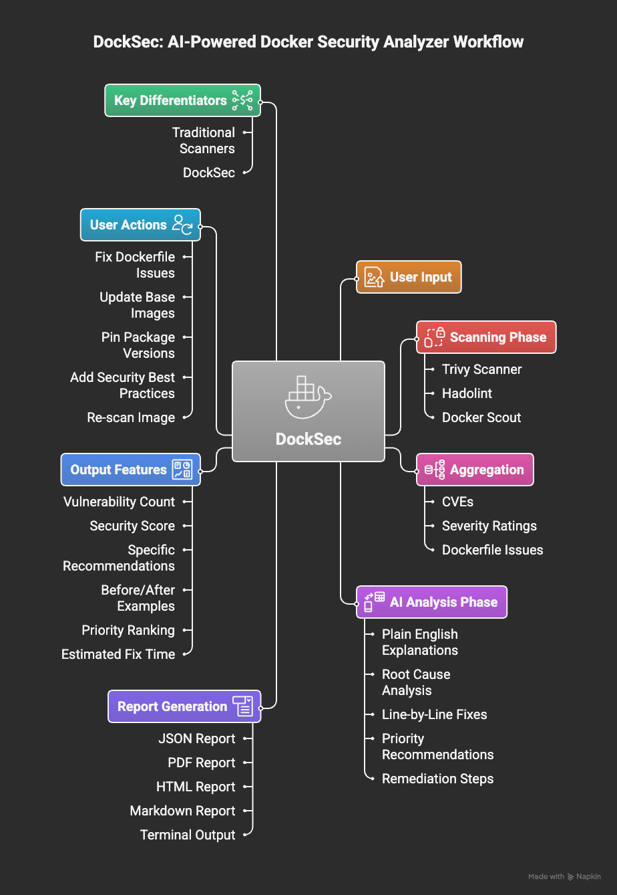

[](https://github.com/advaitpatel/DockSec)
[](https://opensource.org/licenses/MIT)
[](https://pypi.org/project/docksec/)
[](https://pypi.org/project/docksec/)
[](https://owasp.org/www-project-docksec/)

<div align="center">
  
  
  <h1>DockSec</h1>
  <p><strong>AI-powered Docker security scanner that explains vulnerabilities in plain English</strong></p>
  
  <p>
    <a href="#quick-start">Quick Start</a> •
    <a href="#features">Features</a> •
    <a href="#installation">Installation</a> •
    <a href="#usage">Usage</a> •
    <a href="docs/CONTRIBUTING.md">Contributing</a>
  </p>
  
  <br>
  
  <p>
    <a href="https://owasp.org/www-project-docksec/">
      
    </a>
  </p>
  <p><strong>🏆 Officially recognized as an OWASP Incubator Project</strong></p>
  <p>Trusted by the global security community • 14,000+ downloads</p>
</div>

---

## What is DockSec?

DockSec is an **OWASP Incubator Project** that combines traditional Docker security scanners (Trivy, Hadolint, Docker Scout) with AI to provide **context-aware security analysis**. Instead of dumping 200 CVEs and leaving you to figure it out, DockSec:

- Prioritizes what actually matters
- Explains vulnerabilities in plain English  
- Suggests specific fixes for YOUR Dockerfile
- Generates professional security reports

Think of it as having a security expert review your Dockerfiles.

### Why OWASP Recognition Matters

Being recognized as an [OWASP Incubator Project](https://owasp.org/www-project-docksec/) means:
- ✅ **Peer-reviewed** by security professionals
- ✅ **Community-driven** development and governance
- ✅ **Trusted** by enterprises and security teams worldwide
- ✅ **Open source** with transparent security practices
- ✅ **Active maintenance** and regular updates

Join thousands of developers using DockSec to secure their containers.

## How It Works

<div align="center">
  
  <p><em>DockSec workflow: From scanning to actionable insights</em></p>
</div>

DockSec follows a simple pipeline:
1. **Scan** - Runs Trivy, Hadolint, and Docker Scout on your images/Dockerfiles
2. **Analyze** - AI processes all findings and correlates them with your setup
3. **Recommend** - Get plain English explanations with specific line-by-line fixes
4. **Report** - Export results in JSON, PDF, HTML, or Markdown formats

## Quick Start

```bash
# Install
pip install docksec

# Scan your Dockerfile
docksec Dockerfile

# Scan with image analysis
docksec Dockerfile -i myapp:latest

# Scan without AI (no API key needed)
docksec Dockerfile --scan-only
```

## Features

- Smart Analysis: AI explains what vulnerabilities mean for your specific setup
- Multiple LLM Providers: Support for OpenAI, Anthropic Claude, Google Gemini, and Ollama (local models)
- Multiple Scanners: Integrates Trivy, Hadolint, and Docker Scout
- Security Scoring: Get a 0-100 score to track improvements
- Multiple Formats: Export reports as HTML, PDF, JSON, or CSV
- No AI Required: Works offline with `--scan-only` mode
- CI/CD Ready: Easy integration into build pipelines

## Installation

**Requirements:** Python 3.12+, Docker (for image scanning)

```bash
pip install docksec
```

**For AI features**, choose your preferred LLM provider:

### OpenAI (Default)
```bash
export OPENAI_API_KEY="your-key-here"
```

### Anthropic Claude
```bash
export ANTHROPIC_API_KEY="your-key-here"
export LLM_PROVIDER="anthropic"
export LLM_MODEL="claude-3-5-sonnet-20241022"
```

### Google Gemini
```bash
export GOOGLE_API_KEY="your-key-here"
export LLM_PROVIDER="google"
export LLM_MODEL="gemini-1.5-pro"
```

### Ollama (Local Models)
```bash
# First, install and run Ollama: https://ollama.ai
# Then pull a model: ollama pull llama3.1
export LLM_PROVIDER="ollama"
export LLM_MODEL="llama3.1"
# Optional: customize Ollama URL
export OLLAMA_BASE_URL="http://localhost:11434"
```

**External tools** (optional, for full scanning):
```bash
# Install Trivy and Hadolint
python -m docksec.setup_external_tools

# Or install manually:
# - Trivy: https://aquasecurity.github.io/trivy/
# - Hadolint: https://github.com/hadolint/hadolint
```

## Usage

### Basic Scanning

```bash
# Analyze Dockerfile with AI recommendations
docksec Dockerfile

# Scan Dockerfile + Docker image
docksec Dockerfile -i nginx:latest

# Get only scan results (no AI)
docksec Dockerfile --scan-only

# Scan image without Dockerfile
docksec --image-only -i nginx:latest

# Use specific LLM provider and model
docksec Dockerfile --provider anthropic --model claude-3-5-sonnet-20241022

# Use local Ollama model
docksec Dockerfile --provider ollama --model llama3.1
```

### CLI Options

| Option | Description |
|--------|-------------|
| `dockerfile` | Path to Dockerfile |
| `-i, --image` | Docker image to scan |
| `-o, --output` | Output file path |
| `--provider` | LLM provider (openai, anthropic, google, ollama) |
| `--model` | Model name (e.g., gpt-4o, claude-3-5-sonnet-20241022) |
| `--ai-only` | AI analysis only (no scanning) |
| `--scan-only` | Scanning only (no AI) |
| `--image-only` | Scan image without Dockerfile |

### Configuration

Create a `.env` file for advanced configuration:

```bash
# LLM Provider Configuration
LLM_PROVIDER=openai                    # Options: openai, anthropic, google, ollama
LLM_MODEL=gpt-4o                       # Model to use
LLM_TEMPERATURE=0.0                    # Temperature (0-1)

# API Keys
OPENAI_API_KEY=your-openai-key
ANTHROPIC_API_KEY=your-anthropic-key
GOOGLE_API_KEY=your-google-key

# Ollama Configuration (for local models)
OLLAMA_BASE_URL=http://localhost:11434

# Scanning Configuration
TRIVY_SCAN_TIMEOUT=600
DOCKSEC_DEFAULT_SEVERITY=CRITICAL,HIGH
```

See [full configuration options](docs/CONTRIBUTING.md#configuration).

## Example Output

```
🔍 Scanning Dockerfile...
⚠️  Security Score: 45/100

Critical Issues (3):
  • Running as root user (line 12)
  • Hardcoded API key detected (line 23)
  • Using vulnerable base image

💡 AI Recommendations:
  1. Add non-root user: RUN useradd -m appuser && USER appuser
  2. Move secrets to environment variables or build secrets
  3. Update FROM ubuntu:20.04 to ubuntu:22.04 (fixes 12 CVEs)

📊 Full report: results/nginx_latest_report.html
```

## Architecture

```
Dockerfile → [Trivy + Hadolint + Scout] → AI Analysis → Reports
```

DockSec runs security scanners locally, then uses AI to:
1. Combine and deduplicate findings
2. Assess real-world impact for your context
3. Generate actionable remediation steps
4. Calculate security score

**Supported AI Providers:**
- **OpenAI**: GPT-4o, GPT-4 Turbo, GPT-3.5 Turbo
- **Anthropic**: Claude 3.5 Sonnet, Claude 3 Opus
- **Google**: Gemini 1.5 Pro, Gemini 1.5 Flash
- **Ollama**: Llama 3.1, Mistral, Phi-3, and other local models

All scanning happens on your machine. Only scan results (not your code) are sent to the AI provider when using AI features.

## Roadmap

- [x] Multiple LLM provider support (OpenAI, Anthropic, Google, Ollama)
- [ ] Docker Compose support
- [ ] Kubernetes manifest scanning  
- [ ] GitHub Actions integration
- [ ] Custom security policies

See [open issues](https://github.com/advaitpatel/DockSec/issues) or suggest features in [discussions](https://github.com/advaitpatel/DockSec/discussions).

## Contributing

Contributions are welcome! Please see [CONTRIBUTING.md](docs/CONTRIBUTING.md) for guidelines.

Quick links:
- [Report a bug](https://github.com/advaitpatel/DockSec/issues/new?template=bug_report.md)
- [Request a feature](https://github.com/advaitpatel/DockSec/issues/new?template=feature_request.md)
- [View roadmap](https://github.com/advaitpatel/DockSec/issues)

## Documentation

- [Installation Guide](docs/CONTRIBUTING.md#development-setup)
- [Configuration Options](docs/CONTRIBUTING.md#configuration)
- [Changelog](docs/CHANGELOG.md)
- [Security Policy](docs/SECURITY.md)

## Troubleshooting

**"No OpenAI API Key provided"**  
→ Set appropriate API key for your provider (OPENAI_API_KEY, ANTHROPIC_API_KEY, GOOGLE_API_KEY) or use `--scan-only` mode

**"Unsupported LLM provider"**  
→ Valid providers: openai, anthropic, google, ollama. Set with `--provider` flag or LLM_PROVIDER env var

**"Hadolint not found"**  
→ Run `python -m docksec.setup_external_tools`

**"Python version not supported"**  
→ DockSec requires Python 3.12+. Use `pyenv install 3.12` to upgrade.

**"Connection refused" with Ollama**  
→ Make sure Ollama is running: `ollama serve` and the model is pulled: `ollama pull llama3.1`

**"Where are my scan results?"**  
→ Results are saved to `results/` directory in your DockSec installation  
→ Customize location: `export DOCKSEC_RESULTS_DIR=/custom/path`

For more issues, see [Troubleshooting Guide](docs/CONTRIBUTING.md#troubleshooting).

## License

MIT License - see [LICENSE](LICENSE) for details.

## Recognition & Community

<div align="center">
  <a href="https://owasp.org/www-project-docksec/">
    
  </a>
</div>

DockSec is proud to be an **OWASP Incubator Project**, recognized by the Open Web Application Security Project for its contribution to application security.

### What This Means
- **Vetted by Security Experts**: OWASP projects undergo rigorous review
- **Community Trust**: Join thousands of security professionals using OWASP tools
- **Enterprise Ready**: OWASP recognition provides confidence for enterprise adoption
- **Long-term Sustainability**: Backed by a global nonprofit foundation

### Links

- **OWASP Project Page**: https://owasp.org/www-project-docksec/
- **PyPI**: https://pypi.org/project/docksec/
- **Issues**: https://github.com/advaitpatel/DockSec/issues
- **Discussions**: https://github.com/advaitpatel/DockSec/discussions

---

<div align="center">
  
  **If DockSec helps you, give it a ⭐ to help others discover it!**
  
  Built with ❤️ by [Advait Patel](https://github.com/advaitpatel)
  
</div>
