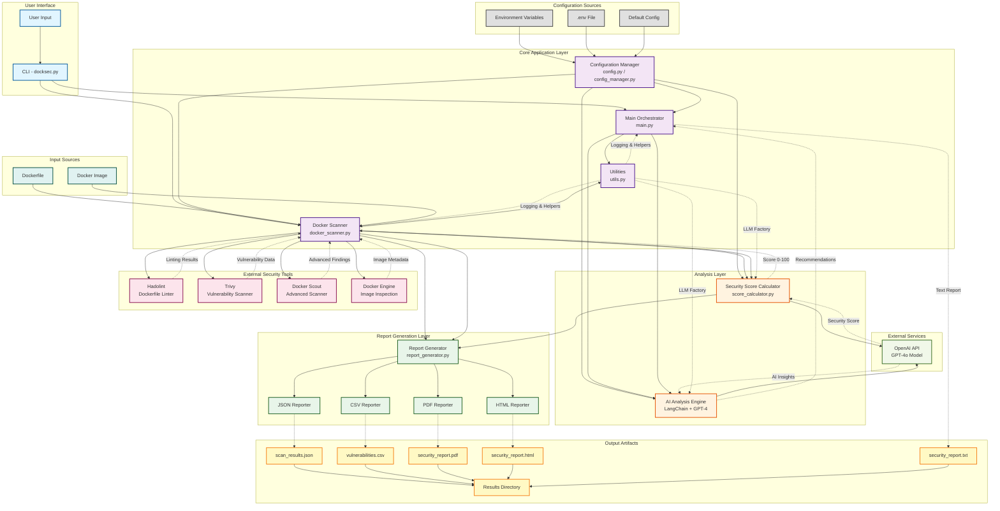

# DockSec System Architecture Diagram

This diagram illustrates the complete system architecture of DockSec, showing all components, external tools, and their interactions.

## Architecture Components Overview

### 1. User Interface Layer
- **CLI (docksec.py)**: Entry point for command-line interface
- Handles argument parsing and mode selection
- Supports multiple scan modes: full, AI-only, scan-only, image-only

### 2. Core Application Layer
- **Main Orchestrator (main.py)**: Coordinates AI-based Dockerfile analysis
- **Docker Scanner (docker_scanner.py)**: Main scanning engine (1289 lines)
  - Orchestrates all security scans
  - Manages external tool execution
  - Handles validation and error recovery
- **Configuration Manager**: Centralized configuration with validation
- **Utilities**: Common helpers, logging, and LLM factory

### 3. Analysis Layer
- **AI Analysis Engine**: LangChain + OpenAI GPT-4o integration
  - Analyzes Dockerfile for security issues
  - Provides best practice recommendations
  - Identifies exposed credentials
  - Suggests remediation steps
- **Security Score Calculator**: LLM-based scoring (0-100)
  - Evaluates vulnerability severity
  - Assesses configuration risks
  - Provides contextual feedback

### 4. Report Generation Layer
- **Report Generator**: Multi-format report creation
  - JSON: Machine-readable structured data
  - CSV: Spreadsheet-friendly vulnerability list
  - PDF: Professional formatted reports
  - HTML: Interactive web-based reports with styling

### 5. External Security Tools
- **Hadolint**: Dockerfile linting and best practices
- **Trivy**: Comprehensive vulnerability scanning
- **Docker Scout**: Advanced security analysis (optional)
- **Docker Engine**: Image inspection and metadata

### 6. External Services
- **OpenAI API**: GPT-4o model for AI analysis and scoring
  - Retry logic with exponential backoff
  - Rate limiting support
  - Timeout handling

### 7. Configuration Sources
- Environment variables
- .env file support
- Default configuration values
- Runtime validation

### 8. Input Sources
- **Dockerfile**: For static analysis and AI recommendations
- **Docker Image**: For vulnerability scanning and runtime analysis

### 9. Output Artifacts
All reports stored in `results/` directory:
- JSON: Complete vulnerability data with metadata
- CSV: Tabular format for spreadsheet analysis
- PDF: Professional document with formatted sections
- HTML: Interactive report with modern UI
- TXT: Human-readable summary with AI insights

## Key Features

### Security & Validation
- Input validation and sanitization
- Path traversal protection
- Command injection prevention
- Secure subprocess execution

### Error Handling & Reliability
- Automatic retry with exponential backoff
- Rate limiting support for API calls
- Graceful degradation (scan-only mode)
- Comprehensive error messages with troubleshooting

### Performance
- Parallel report generation
- Progress indicators for long operations
- Configurable timeouts
- Optimized scanning

### Flexibility
- Multiple scan modes
- Works with or without OpenAI API key
- Configurable via environment variables
- Support for different severity levels

## Data Flow

1. **Input Phase**: User provides Dockerfile and/or image name via CLI
2. **Configuration Phase**: Load and validate configuration from environment
3. **Scanning Phase**: Execute external tools (Hadolint, Trivy, Scout)
4. **Analysis Phase**: AI analyzes results and provides recommendations
5. **Scoring Phase**: Calculate security score based on findings
6. **Report Phase**: Generate all report formats in parallel
7. **Output Phase**: Save reports to results directory

## Integration Points

- **OpenAI API**: For AI analysis and security scoring
- **Hadolint**: For Dockerfile linting
- **Trivy**: For vulnerability scanning
- **Docker Scout**: For advanced scanning (optional)
- **Docker Engine**: For image inspection

## Security Considerations

- No API keys stored in code
- Input validation on all user inputs
- Secure subprocess execution (shell=False)
- Path traversal protection
- Timeout protection for all operations

