# DockSec User Workflow Diagram

This diagram illustrates the complete user workflow from CLI command execution to report generation, showing all decision points and execution paths.

```mermaid
flowchart TD
    START([User Runs DockSec CLI]) --> PARSE[Parse CLI Arguments]
    
    PARSE --> VALIDATE{Validate<br/>Arguments}
    
    VALIDATE -->|Invalid Args| ERROR_ARGS[Display Error Message<br/>and Usage Instructions]
    ERROR_ARGS --> END1([Exit with Error])
    
    VALIDATE -->|Valid Args| CHECK_MODE{Determine<br/>Scan Mode}
    
    CHECK_MODE -->|image-only| MODE_IMAGE_ONLY[Image-Only Mode]
    CHECK_MODE -->|ai-only| MODE_AI_ONLY[AI-Only Mode]
    CHECK_MODE -->|scan-only| MODE_SCAN_ONLY[Scan-Only Mode]
    CHECK_MODE -->|Default| MODE_FULL[Full Scan Mode]
    
    MODE_IMAGE_ONLY --> LOAD_CONFIG[Load Configuration<br/>Environment Variables]
    MODE_AI_ONLY --> LOAD_CONFIG
    MODE_SCAN_ONLY --> LOAD_CONFIG
    MODE_FULL --> LOAD_CONFIG
    
    LOAD_CONFIG --> CHECK_TOOLS{Verify Required<br/>Tools Installed}
    
    CHECK_TOOLS -->|Missing Tools| ERROR_TOOLS[Display Installation<br/>Instructions]
    ERROR_TOOLS --> END2([Exit with Error])
    
    CHECK_TOOLS -->|All Tools Found| CHECK_FILES{Verify Input<br/>Files Exist}
    
    CHECK_FILES -->|File Not Found| ERROR_FILES[Display File<br/>Not Found Error]
    ERROR_FILES --> END3([Exit with Error])
    
    CHECK_FILES -->|Files Valid| CHECK_IMAGE{Verify Docker<br/>Image Exists}
    
    CHECK_IMAGE -->|Image Not Found| ERROR_IMAGE[Display Image<br/>Not Found Error]
    ERROR_IMAGE --> END4([Exit with Error])
    
    CHECK_IMAGE -->|Image Valid| ROUTE_MODE{Route Based<br/>on Mode}
    
    ROUTE_MODE -->|AI-Only| AI_START[Initialize AI Engine]
    AI_START --> AI_CHECK_KEY{OpenAI API<br/>Key Present?}
    AI_CHECK_KEY -->|No Key| ERROR_KEY[Display API Key Error]
    ERROR_KEY --> END5([Exit with Error])
    
    AI_CHECK_KEY -->|Key Valid| AI_LOAD[Load Dockerfile Content]
    AI_LOAD --> AI_ANALYZE[Send to OpenAI GPT-4]
    AI_ANALYZE --> AI_RETRY{API Call<br/>Successful?}
    AI_RETRY -->|Failed and Retries Left| RETRY_WAIT[Wait with Backoff]
    RETRY_WAIT --> AI_ANALYZE
    AI_RETRY -->|Failed No Retries| ERROR_API[Display API Error]
    ERROR_API --> END6([Exit with Error])
    
    AI_RETRY -->|Success| AI_PARSE[Parse AI Response]
    AI_PARSE --> AI_DISPLAY[Display AI Results]
    AI_DISPLAY --> SUCCESS_AI([Analysis Complete])
    
    ROUTE_MODE -->|Scan-Only| SCAN_START[Initialize Scanner]
    SCAN_START --> SCAN_DOCKERFILE{Dockerfile<br/>Provided?}
    
    SCAN_DOCKERFILE -->|Yes| RUN_HADOLINT[Run Hadolint Linting]
    RUN_HADOLINT --> HADOLINT_RESULT{Linting<br/>Issues Found?}
    HADOLINT_RESULT -->|Issues| DISPLAY_LINT[Display Linting Issues]
    HADOLINT_RESULT -->|No Issues| LINT_SUCCESS[No Linting Issues]
    DISPLAY_LINT --> SCAN_IMAGE_CHECK
    LINT_SUCCESS --> SCAN_IMAGE_CHECK
    
    SCAN_DOCKERFILE -->|No| SCAN_IMAGE_CHECK{Image<br/>Provided?}
    
    SCAN_IMAGE_CHECK -->|Yes| RUN_TRIVY[Run Trivy Scan]
    RUN_TRIVY --> TRIVY_PROGRESS[Show Progress Indicator]
    TRIVY_PROGRESS --> TRIVY_COMPLETE{Scan<br/>Complete?}
    
    TRIVY_COMPLETE -->|Timeout| ERROR_TIMEOUT[Display Timeout Error]
    ERROR_TIMEOUT --> END7([Exit with Error])
    
    TRIVY_COMPLETE -->|Success| PARSE_VULNS[Parse Vulnerability Data]
    PARSE_VULNS --> FILTER_VULNS[Filter by Severity]
    FILTER_VULNS --> DISPLAY_VULNS[Display Vulnerabilities]
    
    DISPLAY_VULNS --> RUN_SCOUT{Docker Scout<br/>Available?}
    RUN_SCOUT -->|Yes| SCOUT_SCAN[Run Docker Scout]
    SCOUT_SCAN --> SCOUT_DISPLAY[Display Scout Results]
    SCOUT_DISPLAY --> GEN_REPORTS_SCAN[Generate Reports]
    
    RUN_SCOUT -->|No| GEN_REPORTS_SCAN
    
    SCAN_IMAGE_CHECK -->|No| GEN_REPORTS_SCAN
    
    ROUTE_MODE -->|Image-Only| IMAGE_START[Initialize Scanner]
    IMAGE_START --> IMAGE_TRIVY[Run Trivy on Image]
    IMAGE_TRIVY --> IMAGE_PROGRESS[Show Progress]
    IMAGE_PROGRESS --> IMAGE_PARSE[Parse Results]
    IMAGE_PARSE --> IMAGE_DISPLAY[Display Vulnerabilities]
    IMAGE_DISPLAY --> GEN_REPORTS_IMAGE[Generate Reports]
    
    ROUTE_MODE -->|Full Scan| FULL_START[Initialize Full Scanner]
    FULL_START --> FULL_AI_CHECK{OpenAI API<br/>Key Present?}
    
    FULL_AI_CHECK -->|No Key| WARN_NO_KEY[Warn AI Features Disabled]
    WARN_NO_KEY --> FULL_SCAN_START[Run Security Scans]
    
    FULL_AI_CHECK -->|Key Valid| FULL_AI[Run AI Analysis]
    FULL_AI --> FULL_AI_DISPLAY[Display AI Recommendations]
    FULL_AI_DISPLAY --> FULL_SCAN_START
    
    FULL_SCAN_START --> FULL_HADOLINT[Run Hadolint]
    FULL_HADOLINT --> FULL_HADOLINT_DISPLAY[Display Linting Results]
    FULL_HADOLINT_DISPLAY --> FULL_TRIVY[Run Trivy]
    FULL_TRIVY --> FULL_TRIVY_DISPLAY[Display Vulnerabilities]
    FULL_TRIVY_DISPLAY --> FULL_SCOUT{Docker Scout<br/>Available?}
    
    FULL_SCOUT -->|Yes| FULL_SCOUT_RUN[Run Docker Scout]
    FULL_SCOUT_RUN --> FULL_SCOUT_DISPLAY[Display Scout Results]
    FULL_SCOUT_DISPLAY --> GEN_REPORTS_FULL[Generate All Reports]
    
    FULL_SCOUT -->|No| GEN_REPORTS_FULL
    
    GEN_REPORTS_SCAN --> CALC_SCORE[Calculate Security Score]
    GEN_REPORTS_IMAGE --> CALC_SCORE
    GEN_REPORTS_FULL --> CALC_SCORE
    
    CALC_SCORE --> SCORE_RETRY{Score<br/>Calculation<br/>Success?}
    
    SCORE_RETRY -->|Failed and Retries| SCORE_WAIT[Wait and Retry]
    SCORE_WAIT --> CALC_SCORE
    
    SCORE_RETRY -->|Failed Final| DEFAULT_SCORE[Use Default Score 0]
    DEFAULT_SCORE --> REPORT_GEN[Generate Reports in Parallel]
    
    SCORE_RETRY -->|Success| DISPLAY_SCORE[Display Security Score]
    DISPLAY_SCORE --> REPORT_GEN
    
    REPORT_GEN --> JSON_GEN[Generate JSON Report]
    REPORT_GEN --> CSV_GEN[Generate CSV Report]
    REPORT_GEN --> PDF_GEN[Generate PDF Report]
    REPORT_GEN --> HTML_GEN[Generate HTML Report]
    
    JSON_GEN --> JSON_SAVE[Save to results]
    CSV_GEN --> CSV_SAVE[Save to results]
    PDF_GEN --> PDF_SAVE[Save to results]
    HTML_GEN --> HTML_SAVE[Save to results]
    
    JSON_SAVE --> REPORTS_DONE{All Reports<br/>Generated?}
    CSV_SAVE --> REPORTS_DONE
    PDF_SAVE --> REPORTS_DONE
    HTML_SAVE --> REPORTS_DONE
    
    REPORTS_DONE -->|Yes| DISPLAY_SUMMARY[Display Summary]
    
    REPORTS_DONE -->|Some Failed| WARN_REPORTS[Display Warnings]
    WARN_REPORTS --> DISPLAY_SUMMARY
    
    DISPLAY_SUMMARY --> SUCCESS([Scan Complete])
    
    classDef startEnd fill:#e1f5ff,stroke:#01579b,stroke-width:3px
    classDef process fill:#f3e5f5,stroke:#4a148c,stroke-width:2px
    classDef decision fill:#fff3e0,stroke:#e65100,stroke-width:2px
    classDef error fill:#ffebee,stroke:#c62828,stroke-width:2px
    classDef success fill:#e8f5e9,stroke:#2e7d32,stroke-width:2px
    classDef warning fill:#fff9c4,stroke:#f57f17,stroke-width:2px
    classDef io fill:#e0f2f1,stroke:#00695c,stroke-width:2px
    
    class START,SUCCESS,SUCCESS_AI startEnd
    class END1,END2,END3,END4,END5,END6,END7 error
    class ERROR_ARGS,ERROR_TOOLS,ERROR_FILES,ERROR_IMAGE,ERROR_KEY,ERROR_API,ERROR_TIMEOUT error
    class PARSE,LOAD_CONFIG,AI_LOAD,AI_PARSE,SCAN_START,RUN_HADOLINT,RUN_TRIVY,PARSE_VULNS,FILTER_VULNS process
    class RUN_SCOUT,SCOUT_SCAN,IMAGE_TRIVY,FULL_HADOLINT,FULL_TRIVY,FULL_SCOUT_RUN,CALC_SCORE process
    class REPORT_GEN,JSON_GEN,CSV_GEN,PDF_GEN,HTML_GEN,JSON_SAVE,CSV_SAVE,PDF_SAVE,HTML_SAVE process
    class MODE_IMAGE_ONLY,MODE_AI_ONLY,MODE_SCAN_ONLY,MODE_FULL process
    class VALIDATE,CHECK_MODE,CHECK_TOOLS,CHECK_FILES,CHECK_IMAGE,ROUTE_MODE decision
    class AI_CHECK_KEY,AI_RETRY,SCAN_DOCKERFILE,SCAN_IMAGE_CHECK,TRIVY_COMPLETE,RUN_SCOUT decision
    class HADOLINT_RESULT,FULL_AI_CHECK,FULL_SCOUT,SCORE_RETRY,REPORTS_DONE decision
    class DISPLAY_LINT,LINT_SUCCESS,DISPLAY_VULNS,DISPLAY_SCORE,DISPLAY_SUMMARY success
    class AI_DISPLAY,FULL_AI_DISPLAY,SCOUT_DISPLAY,FULL_SCOUT_DISPLAY,FULL_HADOLINT_DISPLAY,FULL_TRIVY_DISPLAY success
    class WARN_NO_KEY,WARN_REPORTS,DEFAULT_SCORE warning
    class RETRY_WAIT,SCORE_WAIT,TRIVY_PROGRESS,IMAGE_PROGRESS io
```



## Workflow Overview

This diagram shows the complete execution path for DockSec from user input to final output. The workflow adapts based on the selected scan mode and handles various error conditions gracefully.

## Scan Modes Explained

### 1. AI-Only Mode (`--ai-only`)
**Purpose**: Quick AI analysis of Dockerfile without external scanning tools

**Workflow**:
1. Load and validate Dockerfile
2. Check OpenAI API key
3. Send Dockerfile to GPT-4 for analysis
4. Display AI recommendations (no reports generated)

**Use Case**: 
- Quick security review during development
- Get best practice recommendations
- Identify potential issues before building image

**Requirements**: 
- Dockerfile
- OpenAI API key

---

### 2. Scan-Only Mode (`--scan-only`)
**Purpose**: Security scanning without AI analysis (works without API key)

**Workflow**:
1. Run Hadolint on Dockerfile (if provided)
2. Run Trivy vulnerability scan on image
3. Run Docker Scout (if available)
4. Generate all reports (JSON, CSV, PDF, HTML)
5. Calculate security score using LLM (if API key available)

**Use Case**:
- CI/CD pipelines without OpenAI API
- Focus on vulnerability detection
- Compliance scanning

**Requirements**:
- Dockerfile and/or Docker image
- Hadolint, Trivy installed
- No API key required (score calculation skipped if no key)

---

### 3. Image-Only Mode (`--image-only`)
**Purpose**: Scan Docker image without Dockerfile analysis

**Workflow**:
1. Skip Dockerfile linting
2. Run Trivy on Docker image
3. Generate reports with vulnerability data
4. Calculate security score

**Use Case**:
- Scan pre-built images
- Third-party image analysis
- Production image auditing

**Requirements**:
- Docker image (local or pulled)
- Trivy installed

---

### 4. Full Scan Mode (Default)
**Purpose**: Comprehensive security analysis with all features

**Workflow**:
1. Run AI analysis on Dockerfile
2. Run Hadolint linting
3. Run Trivy vulnerability scan
4. Run Docker Scout (if available)
5. Calculate security score using LLM
6. Generate all report formats
7. Display comprehensive summary

**Use Case**:
- Complete security assessment
- Pre-production validation
- Detailed security reporting

**Requirements**:
- Dockerfile
- Docker image
- OpenAI API key (recommended)
- All tools installed

---

## Key Decision Points

### 1. Argument Validation
- Validates CLI arguments before processing
- Ensures required files/images exist
- Provides helpful error messages

### 2. Tool Availability Check
- Verifies Hadolint, Trivy, Docker are installed
- Provides installation instructions if missing
- Fails fast with actionable guidance

### 3. API Key Handling
- Checks for OpenAI API key when AI features requested
- Graceful degradation in Full Scan mode (continues without AI)
- Clear error messages with setup instructions

### 4. Retry Logic
- Automatic retry with exponential backoff for API calls
- Handles rate limiting gracefully
- Maximum 3 attempts before failing

### 5. Report Generation
- All reports generated in parallel for performance
- Continues even if some report formats fail
- Displays warnings for failed reports

---

## Error Handling Points

### Input Validation Errors
- Invalid arguments → Display usage and exit
- File not found → Display path and exit
- Image not found → Display Docker instructions

### Tool Availability Errors
- Missing tools → Display installation instructions
- Tool execution timeout → Suggest configuration changes

### API Errors
- No API key → Show setup instructions
- Rate limit → Automatic retry with backoff
- API failure → Display troubleshooting steps

### Report Generation Errors
- Individual format failures → Continue with other formats
- Display warnings for failed reports
- Ensure at least JSON report succeeds

---

## Progress Indicators

The workflow includes real-time feedback:
- **Scanning Phase**: Progress bars for long-running scans
- **API Calls**: Spinner indicators during AI analysis
- **Report Generation**: Progress indicators for each format
- **Status Messages**: Color-coded success/warning/error messages

---

## Output Summary

After successful execution, users receive:
1. **Console Output**: 
   - Color-coded vulnerability findings
   - AI recommendations (if enabled)
   - Security score with contextual feedback
   - Report file locations

2. **Report Files** (in `results/` directory):
   - `{image}_scan_results.json`: Complete vulnerability data
   - `{image}_vulnerabilities.csv`: Spreadsheet format
   - `{image}_security_report.pdf`: Professional document
   - `{image}_security_report.html`: Interactive web report
   - `security_report.txt`: AI recommendations (AI-only mode)

3. **Exit Code**:
   - `0`: Success (no critical issues or scan completed)
   - `1`: Errors encountered or vulnerabilities found

---

## Performance Characteristics

### Typical Execution Times
- **AI-Only**: 5-15 seconds (depends on API latency)
- **Scan-Only**: 1-5 minutes (depends on image size)
- **Image-Only**: 1-3 minutes
- **Full Scan**: 2-6 minutes

### Optimization Features
- Parallel report generation
- Progress indicators for user feedback
- Configurable timeouts
- Efficient vulnerability filtering

---

## Best Practices for Users

### Development Workflow
1. Use `--ai-only` during Dockerfile development
2. Run `--scan-only` before committing
3. Execute full scan before deployment

### CI/CD Integration
1. Use `--scan-only` for pipeline scans (no API key needed)
2. Set appropriate timeouts for large images
3. Parse JSON output for automated decisions

### Production Auditing
1. Use `--image-only` for third-party images
2. Schedule regular full scans
3. Monitor security scores over time

---

## Command Examples

```bash
# Quick AI feedback during development
docksec Dockerfile --ai-only

# CI/CD pipeline scan (no API key required)
docksec Dockerfile -i myapp:latest --scan-only

# Scan production image
docksec --image-only -i production/myapp:v1.2.3

# Complete security assessment
docksec Dockerfile -i myapp:latest

# Custom output location
docksec Dockerfile -i myapp:latest -o custom_report.txt
```

